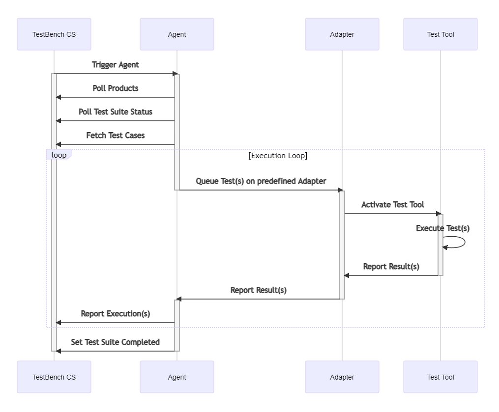

<!-- markdownlint-disable-file MD033 -->

# Test Case Automation Agent for TestBench&nbsp;CS

<p align="center">
  <a href="https://www.testbench.com/de/"></a>
</p>

* [Overview](#overview)
* [How it works](#how-it-works)
* [How to use it](#how-to-use-it)
* [Configuration](#configuration)
* [Adapter Overview](#adapter-overview)

---

## Overview

The Test Automation Agent can automatically run existing Test Suites and Test Sessions in TestBench CS. The Test Cases in the Test Suites and Test Sessions are executed using a specified Test Tool and the test results are written back into TestBench CS.

**[Apache License Version 2.0](./LICENSE)**, See *[COPYRIGHT](./COPYRIGHT)*

---

## How it works

<p align="center">
  <a href="./docs/assets/Sequence_Diagram.md"></a>
</p>

### Sequence

The Agent monitors TestBench&nbsp;CS and searches for Test Suites in  status `Active`, and for Test Sessions in status `Ready`.

* If it finds a matching Test Suite (precondition: active user is a resposible user in that Test Suite), it extracts all Test Cases that match  a predefined  filter and creates a new test session. A new test execution is generated for each of the Test Cases.
* If it finds a matching Test Session (precondition: active user is a participant in that Test Session), it extracts all existing Test Executions.

If files are attached to the Test Case, the Agent downloads and stores them in a temporary folder. Depending on the value in a Custom Field "Test Tool" (in the Test Case) a specific Adapter is chosen. Adapters link the agent to a test automation tool or framework, so an adapter is always specific for one tool. The specified Adapter is called to execute the Test Case using the corresponding Test Tool.

After execution, the Adapter receives the result from the Test Tool and passes it on to the Agent. The Agent then adds the  result of the Test Case Execution to the Test Session. After execution of all Test Cases of the Test Suite or Test Session, the Agent sets the status of the Test Suite and the Test Session to "Completed" and continues monitoring.

### Actors

Four actors are involved in the overall process of automatically executing Test Suites and uploading test results to TestBench&nbsp;CS:

1. `TestBench CS`: It holds the Test Suites, Test Cases, and Test Sessions

2. `Agent`: Communicates between TestBench&nbsp;CS and the Adapters. It is also responsible for fetching the Test Cases and writing back the results

3. `Adapter`: Receives the Test Cases from the Agent and runs them with the specified Test Tool

4. `Test Tool`: The tool that is used for testing.

---

## How to use it

### **Prerequisites**

* Create a Custom Field "Test Tool" in TestBench&nbsp;CS (optional, required to specify test tool per Test Case instead of having one default tool for all Test Cases)
* Download or clone this repository
* Install *python3* >= 3.8 (source: <https://www.python.org/>)
* Install *pip3* (source <https://pip.pypa.io/en/stable/installation/>)
* Install packages:

  ```sh
  pip install -r requirements.txt
  ```

### **How to run it**

1. Fill in the required data in the config file and in TestBench&nbsp;CS

2. Open the root folder of the test automation script in a terminal

3. Execute the script with the following command:

    ```sh
    python agent.py
    ```

4. If you want to run the script continuously, you need to specify the "--loop" flag

    ```sh
    python agent.py --loop
    ```

5. You can stop the script using  `CTRL+C`

---

## How to execute Test Suites using the Agent

Set the status of the Test Suite to be executed automatically to "Active".

<p align="center">
  
</p>

---

## Configuration

### **In the config file**

The template (config.py.template) for the configuration is located in the root directory. Based on this, the file `config.py` must be created and adapted accordingly.
It contains the following dictionaries / variables:

#### **Account**

Basic information to log in to TestBench&nbsp;CS

* TBCS_BASE = "`TestBench CS URL`"
* WORKSPACE = "`Name of the Workspace`"
* LOGIN = "`Username`"
* PASSWORD = "`Password`"

#### **Test Session Prefix**

* The Test Session name will be concatenated like this: "`Test Session Prefix` + `Test Suite name` + `Date and Time`"
* You can define the Prefix using this variable

#### **Test Case filter**

* Test Cases can be filtered by regular expression matching:

  ```bash
  "name": re.compile("Test*") # Matches Test, Test1, Tes, ...
  "name": re.compile(".") # Matches everything except '\n'
  ```

#### **Test Suite filter**

* Test Suites can be filtered by regular expression matching and status in TestBench&nbsp;CS:

  ```bash
  "name": re.compile("Suite*") # Matches Suite, Suite1, Suit, ...
  "status": "Active"
  ```

#### **Test Session filter**

* Test Sessions can be filtered by regular expression matching and status in TestBench&nbsp;CS:

  ```bash
  "name": re.compile("Session*") # Matches Session, Session1, Sessio, ...
  "status": "Ready"
  ```

#### **Product filter**

* Products can be filtered by regular expression matching:

  ```bash
  "name":re.compile("Pro*") # Matches Product, Pro, Pr, ...
  "name":re.compile(".") # Matches everything except '\n'
  ```

#### **Custom Field name**

* The name of the Custom Field in the Test Cases that describes which test tool should be used.

#### **Default Adapter**

* Here you can specify the default Adapter. It is used if the custom field for the test tool is not defined or set in TestBench&nbsp;CS.

#### **Parallel**

* If the "`Parallel`" Custom Field is not set in TestBench&nbsp;CS, this value is used to determine whether the Test Case should be executed *parallel* (*non-blocking*) or *sequential* (*blocking*). The value of this variable is a boolean value (`True` or `False`).

#### **Create Defects**

* Defines whether adapters that can create defects automatically do so. The value of this variable is a boolean value (`True` or `False`).

### **In TestBench&nbsp;CS**

You need to fill in the Custom Field "`Test Tool`" in each Test Case with the Test Tool to be used. If you don't, the default Adapter defined in the config file will be used. If the Custom Field is missing or not set and the entry " `ADAPTER_DEFAULT` " in the config file is empty, the Agent returns an error and stops running.

---

## Adapter overview

In principle, any test tool can be used for automation. A dedicated Adapter is required for each test tool to connect it to the Agent.

So far some adapters for Test Tools are described under [Adapters](./docs/adapter/))

### **Structure and parameters**

All Adapters must follow the same basic structure, otherwise they will not work properly. Therefore a new created adapter must inherit the "`AdapterTemplate`" class found in the "`AdapterTemplate.py`" file. This class also functions as a template with some additional information about the methods of an Adapter. Please use it if you want to [create your own Adapter](#creating-your-own-adapter).

The Adapter has to contain a class with the same name as the filename. If for example the Adapter-filename is "`adapterTemplate.py`", the classname has to be "`adapterTemplate`".

The Adapter also needs the following three functions:

* `__init__(self, tbcs, concrete_test_case, abstract_test_case, execution_id, temp_dir)`</br>Initializes the instance to fill the required class variables.

* `execute_test_case(self, parallel, ddt_row)`</br>This will be called by the Agent and executes the given Test Case on a specific Test Tool. This method needs to <span style="color:plum">return</span> a <span style="color:lawngreen">subprocess</span> instance.

* `check_result(self, executed_cmd)`</br>Agents calls it to get a result from the executed command. It has to <span style="color:plum">return</span> "Passed" or "Failed".

### **Creating your own Adapter**

Creating your own Adapter is easy.

If you want to create your own Adapter, please consult the [Structure and Parameters](#structure-and-parameters) section. It shows you what an Adapter needs to work properly. If you inherited the "`AdapterTemplate`" class and filled all required functions with your needs, put the file into the folder "`adapters`". The agent automatically finds the Adapter by the name of the custom field or by your configuration variable [Default Adapter](#default-adapter).

---

### **Parallel Processing**

Test Cases can be processed in parallel. To do this, either create a Custom Field named "`Parallel`" or change the [Parallel](#parallel) variable in the config file to `True`. The custom field allows you to specify for each test case whether it should run in parallel or not. A third option is explained in the next section [Data Driven Testing](#data-driven-testing).

#### **NOTE**

The agent will execute test cases in parallel if you request it, but it is up to you to ensure that parallel execution of test cases leads to valid results by designing the test cases appropriately!

---

### **Data Driven Testing**

The Agent is able to handle Data Driven Tests (DDT). To do this, simply create a Test Case with a table for DDT and assign the specific Test Cases to the Test Suite to be executed. It is possible to specify for each row whether it should be executed blocking or non-blocking. To do this, you must reference the column in the custom field " `Parallel`".

<ins>*For example:*<ins>

If you have a column called " `runNonBlocking` " in the DDT table, the value of your Custom Field should look like this: <span style="color:plum">${runNonBlocking}</span>.

In this column you can specify if the Test Case using the values of this row should run non blocking. Accepted values are:
  
* True / False
* T / F
* 1 / 0
* Yes / No
* Y / N

Upper or lower case is both accepted. If the column contains a non valid value, it will run sequentially.
