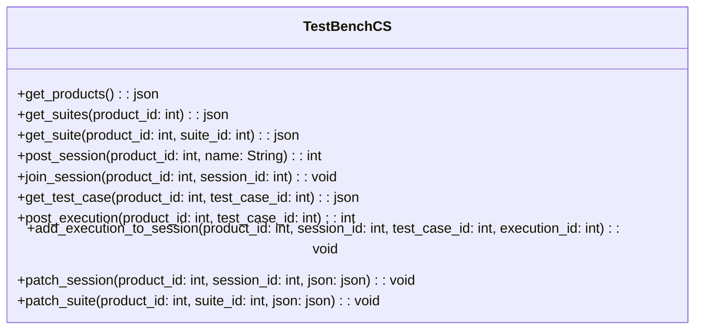
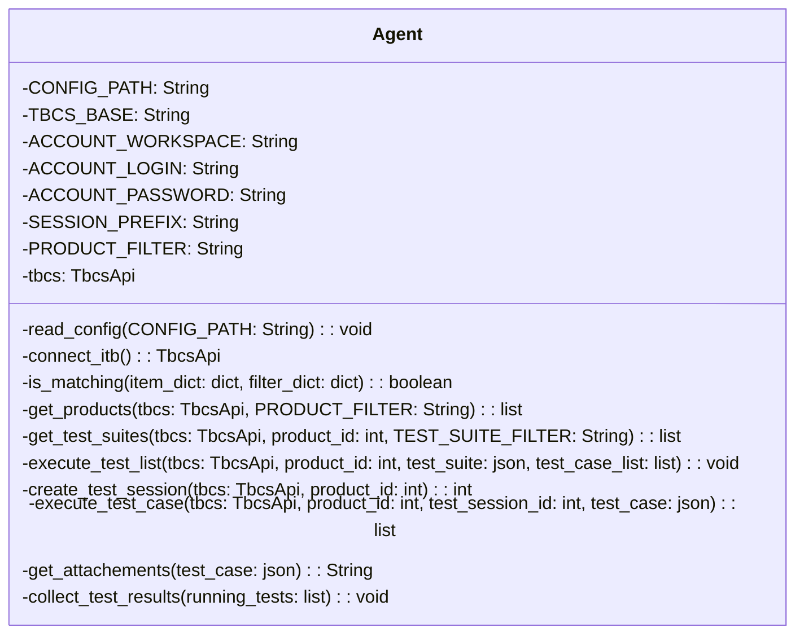
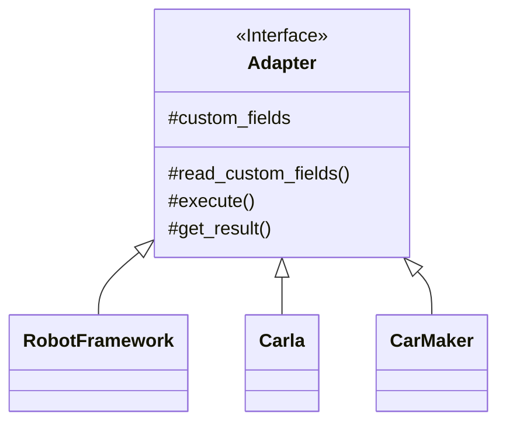

# Architecture

In the whole process are 4 participants involved to automatically execute Test Suites and upload the test results into TestBench&nbsp;CS:

## TestBench CS

It contains the Test Suites and Test Cases and after all tests finished also a Test Session

---

## Agent

Communicates between TestBench&nbsp;CS and the Adapters. It is also responsible for fetching the Test Cases and writing the results back

---

## Adapter

Receives Test Case from Agent and runs it on the specified Test Tool

---

## Test Tool

The tool, which will be used for testing.
