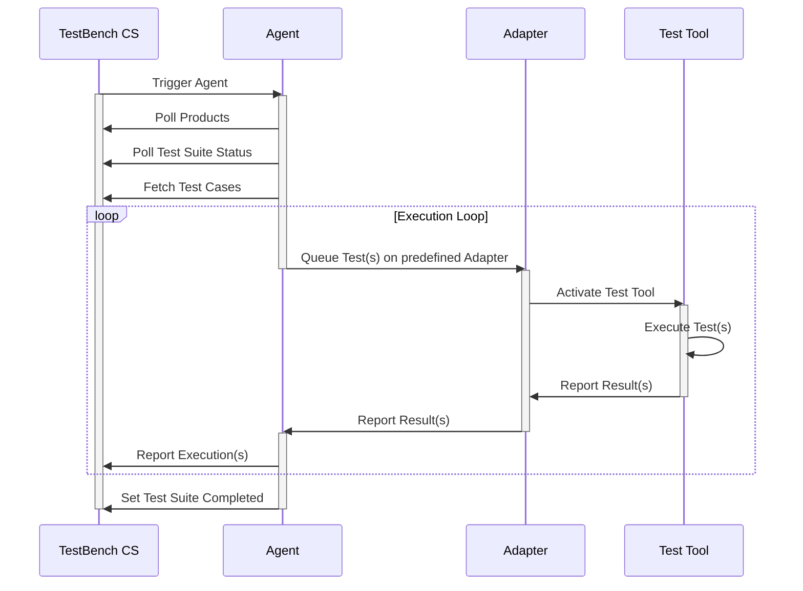

# Sequence Diagram of Test Automation

```mermaid
sequenceDiagram
    participant TestBench as TestBench CS
    participant Agent
    participant Adapter
    participant Automation as Test Tool
    TestBench->>Agent: Trigger Agent
    activate TestBench
    activate Agent
    Agent->>TestBench: Poll Products  
    Agent->>TestBench: Poll Test Suite Status   
    Agent->>TestBench: Fetch Test Cases
    loop Execution Loop
        Agent->>Adapter: Queue Test(s) on predefined Adapter
        deactivate Agent
        activate Adapter
        Adapter->>Automation: Activate Test Tool
        activate Automation
        Automation->>Automation: Execute Test(s)
        Automation->>Adapter: Report Result(s)
        deactivate Automation
        Adapter->>Agent: Report Result(s)
        deactivate Adapter
        activate Agent
        Agent->>TestBench: Report Execution(s)
    end
    Agent->>TestBench: Set Test Suite Completed
    deactivate Agent
    deactivate TestBench
```
